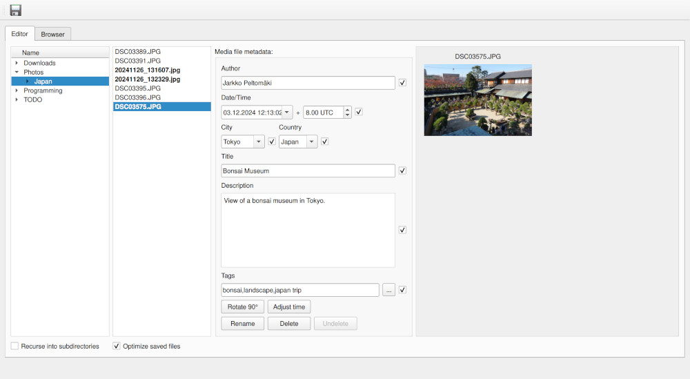

# Arris, an image metadata editor

Arris is a minimalistic application that can be used to edit the metadata of
digital photos.

The currently supported metadata entries are

* **author** (Xmp.dc.creator): The name of the person who took the photo (only one author is supported).
* **date time** (Xmp.dc.date): The date and time when the photo was taken (UTC offsets supported).
* **city** (Xmp.iptcExt.City): The city in which the photo was taken.
* **country** (Xmp.iptcExt.CountryName): The country in which the photo was taken.
* **title** (Xmp.dc.title): Title caption of the photo. Check configuration below to select language correctly.
* **description** (Xmp.dc.description): A more elaborate description of the photo.
* **tags** (Xmp.dc.subject): Keywords for the photo.

The metadata entries are saved as XMP tags, and they can thus be read by other
applications.

The aim of Arris is to be a simple GUI program with minimal dependencies. It is
meant as a simple personal tool to manage private photos locally on disk. Photo
import and editing will not be supported and should be done with separate
tools. Currently only photo metadata editing is supported, but the eventual
goal is to support saving the images in a simple local and searchable database.
There will not be any integration with any cloud service as this software is
intended for local and private use.

# Installation and dependencies

Running Arris is as simple as cloning the repository and running
`python3 arris.py`. Arris was developed on Python 3.13, but it should run on
earlier versions of Python just fine. For windowing, Arris uses Qt version 6,
so your operating system should have the necessary libraries installed. The
necessary Python package dependencies are listed in `requirements.txt`. In
addition, Arris needs the command line utilities `exiv2` and `jpegtran`. On
most distros, the former is included in the package `exiv2` and the latter in
`libjpeg-turbo` or similar.

# Brief usage instructions

The metadata editor is on the `Editor` tab of the Arris main window (the
`Browser` tab is empty and is to be implemented in the future). Use the left
panel to navigate to a directory with photos you want to organize. The loaded
photos are then displayed in the next panel (only JPG,CR2,RW2 files are
supported at the moment). When a photo is selected, the third panel will
display its XMP metadata (if it exists), and the photo is displayed in the
final panel. The date time is loaded from an EXIF tag (typically saved by
digital cameras) if the XMP date time tag is not found.

Once the metadata is loaded, you can edit it using the third panel's entries.
The tags are listed as comma-separated entries. There is a tag editor that
opens by clicking the button next to the tag entry, but it currently does not
load any tags to be added.

Once you have edited the metadata, you can save the edits by clicking the save
button in the top-left corner. No edits to files on disk are made unless you
click this button. Any unsaved photos are displayed in bold in the second
panel.

If you want to delete a photo, select it, and click the `Delete` button. The
corresponding file is deleted only if the save button is pressed. If you want
to cancel the deletion, click the undelete button to prevent all files from
being deleted.

## Editing multiple photos at once
To avoid repetitive tasks, multiple photos can be selected in the second panel.
The program logic is then somewhat different than when editing a single file.
Given a metadata entry X (say author), if all selected photos have a common
value for X, then it is displayed in the corresponding field. Edits to this
field are reflected in all selected photos. If the photos do not have a common
value for X, then the corresponding field is disabled, and no edits are made
for the selected files. If the field is manually enabled via the checkbox next
to it, the (noncommon) values for X are overwritten with the value that is
typed in the field. It is best if you experiment with this feature. As long as
you do not press the save button, nothing will happen to the files on the disk.

Notice that the date time and the UTC offset entries are always disabled when
multiple files are selected (as it rarely makes sense for photos to have
exactly the same timestamp). If these fields are manually enabled, then a
common value can be set.

## Renaming files
Edited files can be renamed by clicking the `Rename` button (the new file name
will be displayed) in the second panel. Currently a photo is renamed as
`YYYYDDMM_HHMMSS.ext` according to the date time entry (the UTC offset is
ignored). The corresponding files are not renamed unless the save button is
pressed.

## Rotating files.
Clicking the `Rotate` button rorates the selected photos 90 degrees clockwise.
Again, the rotation is not performed on disk unless the save button is clicked.
Arris resets the `Exif.Image.Orientation` tag appropriately so that other
applications will show the rotated image correctly.

## UTC offsets and time adjustment
The UTC offset field (adjacent to the date time field) indicates in which UTC
offset the local time in the date time field should be interpreted in. For
example if the date time field reads `7.8.2024 12:48:52` and the UTC offset is
`3.00`, then it means that the photo was taken at the time instant
`2024-08-07T12:48:52+03:00` (ISO format). Whenever the UTC offset is adjusted,
the local time is left as it is. If you need the local time to change when the
UTC offset changes, you need to type this in manually.

To aid in editing photos that have incorrect date times (wrong date settings in
the camera), you can add and subtract the date time fields and UTC offset
fields of multiple photos via the time adjuster. Suppose that you have multiple
photos selected, and you want to add one hour to the local time and one hour to
the UTC offset (due to, e.g., daylight savings). Then click the button `Adjust
time` and set `Hours` to `1` and `UTC` to `1`, and click `OK`. Now all selected
photos have been adjusted as desired.

Notice that fractional UTC offsets are supported with 2 digit accuracy. Namely,
if the UTC offset in Arris is `2.50` then the ISO format is trailed with
`+02:30`.

## Photo optimization
Arris uses the `jpegtran` utility to optimize the DFT coefficients of saved JPG
files. This is a lossless transformation that saves some disk space. In
addition to this, Arris strips embedded EXIF thumbnails from the photos to save
a bit more space. Photo optimization can be disabled by unchecking the box
`Optimize saved files`.

# Configuration file

The file `~/.arris.cfg` can be used to configure some settings of Arris. This
file is in the ini format, and an example configuration file is found in the
repository. Here is an explanation of the settings.

* general
    - **default_language**: The default language of the title and description
      XMP tags. The language information will be saved in the XMP metadata.
      Default: `en-US`.
    - **default_time_zone**: Default time zone when interpreting date times
      without UTC offset (e.g., when reading date times from EXIF time stamps).
      The time zone should be given as a string accepted by the `pytz` library.
      Default: `UTC+0`. 
* completion
    - **author**: Comma separated list of autocomplete values for the `author`
      field.
    - **city**: Comma separated list of autocomplete values for the `city`
      field.
    - **country**: Comma separated list of autocomplete values for the
      `country` field.

